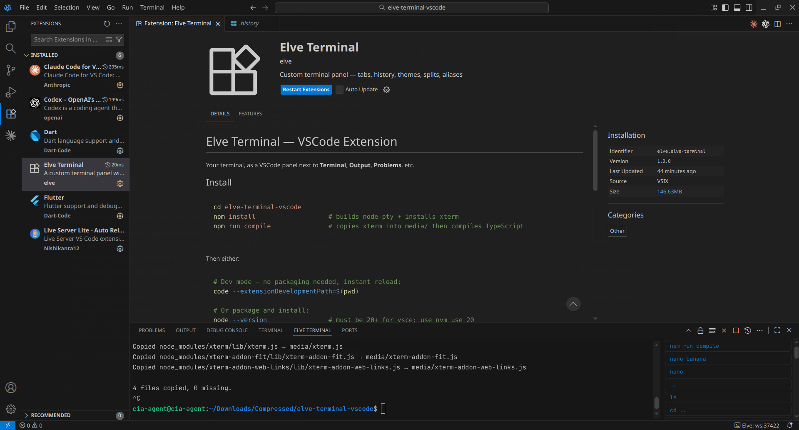

# Elve Terminal 

# ToDo:
<pre>
  -Fix history, just read bash history or .history file 60 enteries at each enter
</pre>

# Screenshot  

A powerful terminal panel for Visual Studio Code — tabs, split views, per-directory history, themes, and aliases, all living right next to your **Terminal**, **Output**, and **Problems** panels.

## Features

### Tabs
A collapsible sidebar on the left lists all your open terminal tabs. Hover to expand it, click a tab to switch, and use the **+** row at the bottom to open a new one. Each tab tracks its current directory and updates its label automatically.

### Split Views
Right-click anywhere in the terminal to split horizontally or vertically. Each pane runs its own shell session and tracks its own working directory. Drag the divider between panes to resize them. Click a pane to focus it — the history panel updates to reflect that pane's directory.

### Per-Directory History
Elve keeps a `.history` file in each directory you work in (once you create one), falling back to `~/.elve_history` globally. Commands are deduplicated and capped at 60 entries. Click the **History** button (⟳) in the panel header to open the history sidebar. Clicking a command in the list runs it immediately and moves it to the top.

Use **Menu → Create history file** to create a `.history` file in the current directory.

### Panel Header Buttons
All controls live in the VS Code panel header — no extra toolbar cluttering your terminal space:

| Button | Action |
|--------|--------|
| › (chevron) | Toggle the tab sidebar |
| 🔒 | Quick Password — saves a password for fast `sudo` access |
| 🗑 | Clear the terminal |
| ✕ | Clear the current line (Ctrl+U) |
| ⏹ | Kill the current process (Ctrl+C) |
| ⟳ | Toggle history sidebar |
| ⋯ | Open submenu (Aliases, Settings, Create history file) |

### Themes
Choose from **VSCode** (follows your editor theme), GitHub Dark, Dracula, Monokai, Solarized Dark, or Nord. Customise hue, brightness, saturation, and opacity independently.

### Aliases
Open **Menu → Aliases** to manage shell aliases. Aliases from your `.bashrc` / `.zshrc` are automatically detected and shown. Save to apply them in every open session.

### Settings
Font family, size, theme, and all visual options are in **Menu → Settings**. There is also an optional bottom input box that lets you type commands without clicking into the terminal first.

### Right-Click Menu
Right-clicking in the terminal shows quick actions: Copy, Paste, Split, and — when text is selected — one-click installs via `pacman`, `yay`, `apt-get`, `dnf`, or a web search.

## Keyboard Shortcut

| Shortcut | Action |
|----------|--------|
| `Ctrl+Alt+E` / `Cmd+Alt+E` | Focus Elve Terminal panel |

## Requirements

- VS Code 1.80+
- Node.js 18+ (for the extension host — already bundled with VS Code)
- A POSIX shell (bash, zsh, fish, etc.) — Windows support via PowerShell

## Tips

- Add `.history` to your global `.gitignore` to avoid committing per-directory history files.
- Right-click the 🔒 button to update a saved password.
- The tab sidebar collapses to a thin 28 px rail — hover to peek, click the **›** button to hide it fully.
